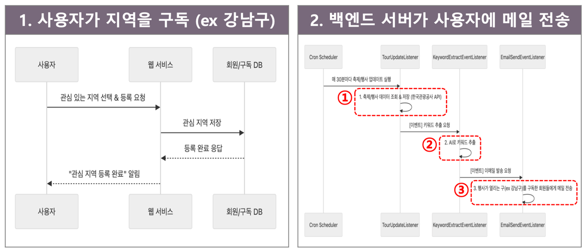
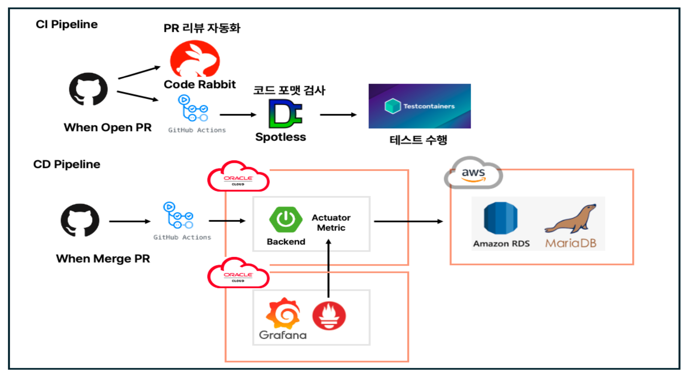

# 프로젝트 소개

바쁜 일상을 보내느라 주말에 뭐 할지 고민하셨나요? 관심있는 동네를 고르면, 동네 축제를 픽해드려요
픽동과 함께 우리 동네 재밌는 행사를 놓치지 마세요!

https://www.pickdong.com

## 메일 전송 과정
1. 축제 데이터 갱신: 한국 관광공사 API를 활용하여 새로운 축제를 주기적으로 갱신합니다
2. 축제 키워드 추출: AI를 활용하여 축제 정보를 한눈에 볼 수 있는 키워드를 추출합니다
3. 메일 전송: 축제가 열리는 지역을 구독한 사용자에게 메일을 전송합니다

## 클라우드 & CI/CD 인프라

### CI (Continuous Integration)
- **트리거**: main 브랜치에 `pull_request` 이벤트가 발생할 때 실행됩니다.
- **주요 작업**:
    1. Spotless를 통해 코드가 컨벤션을 준수하는지 확인합니다.
    2. `./gradlew clean test` 명령어를 통해 프로젝트를 빌드하고 모든 테스트 코드를 실행합니다.

### CD (Continuous Deployment)
- **트리거**: `main` 브랜치에 `push` 이벤트가 발생할 때 워크플로우가 실행됩니다.
- **주요 작업**:
    1. 프로젝트를 빌드하고 Docker 이미지를 생성합니다.
    2. 생성된 이미지를 GHCR에 푸시합니다.
    3. Oracle 서버에 SSH로 접속하여 최신 Docker 이미지를 pull 받고, 기존 컨테이너를 중지한 후 새로운 컨테이너를 실행하여 애플리케이션을 배포합니다.